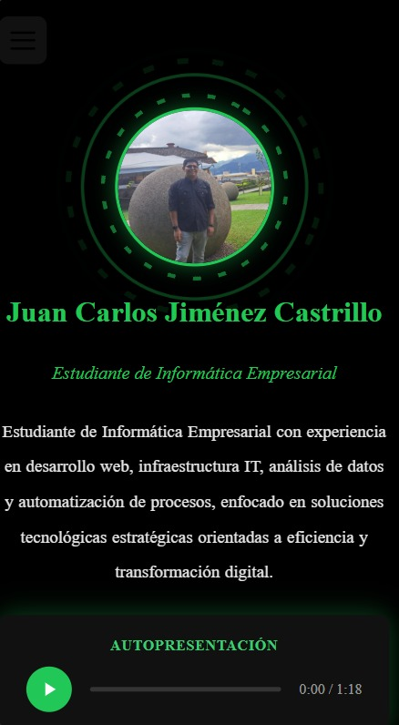
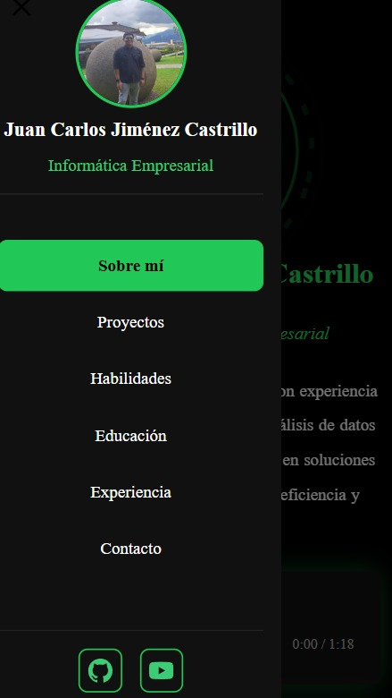

# Juan Carlos Jiménez | Portafolio Personal

Portafolio personal multimedia desarrollado con **Vue 3** + **Vite** como proyecto para el curso IF7102 Multimedios — Universidad de Costa Rica, I Ciclo 2026.

## Framework elegido

**Vue 3** con Composition API y `<script setup>` (declarado desde la semana 12).

## Descripción

Sitio web de presentación profesional — Opción 1: Portfolio Multimedia Personal. Incluye secciones de presentación, habilidades, experiencia, educación e información de contacto.

La arquitectura sigue el patrón **Single Source of Truth**: `App.vue` realiza un único `fetch()` a `public/data/portafolio.json` al montarse y distribuye los datos a todos los componentes hijos mediante **props**. Ningún componente hijo hace su propio fetch. Los assets multimedia (foto, audio, video) se referencian con `new URL(..., import.meta.url)` para resolución dinámica de rutas procesadas por Vite.

## Tecnologías

- Vue 3 + Composition API (`<script setup>`, `ref`, `computed`, `reactive`, `onMounted`)
- Vite (bundler, servidor de desarrollo, resolución dinámica de assets con `import.meta.url`)
- CSS nativo con variables personalizadas y animaciones `@keyframes`
- Intersection Observer API (animaciones de entrada por scroll)
- Google Fonts — Inter
- JSON + `fetch()` para carga de datos (centralizado en App.vue)

## Paleta de colores

Paleta personalizada definida con variables CSS en `src/css/global.css`.

| Variable | Hex | Uso |
|---|---|---|
| `--negro` | `#000000` | Fondo general |
| `--negro-card` | `#111111` | Fondo de tarjetas y superficies |
| `--blanco` | `#ffffff` | Texto principal |
| `--verde-1` | `#39ff14` | Neon green — títulos llamativos |
| `--verde-2` | `#00c851` | Acento principal — botones, bordes activos |
| `--verde-3` | `#2ecc71` | Esmeralda — acento secundario |
| `--verde-4` | `#7fff00` | Chartreuse — variante cálida |
| `--verde-5` | `#b2ff59` | Verde pastel claro |
| `--gris-claro` | `rgba(255,255,255,0.55)` | Texto secundario / descripciones |

## Requisitos

- Node.js 18+
- pnpm (recomendado) o npm

## Instalación y ejecución

```bash
pnpm install
pnpm run dev
```

O con npm:

```bash
npm install
npm run dev
```

## Estructura del proyecto

```
portafolio-personal/
├── public/
│   ├── data/
│   │   └── portafolio.json    # Datos personales y CV
│   └── favicon.ico
├── src/
│   ├── assets/                # Imágenes, audio, recursos propios
│   ├── components/            # Componentes Vue reutilizables
│   ├── css/
│   │   └── global.css         # Estilos globales + paleta Hills
│   ├── App.vue
│   └── main.js
├── index.html
└── package.json
```

## Capturas de pantalla

### Vista escritorio

| Sección | Vista |
|---|---|
| Sobre mí |  |
| Proyectos |  |
| Habilidades |  |
| Experiencia |  |
| Educación |  |
| Contacto |  |

### Vista móvil

| Vista |
|---|
|  |
|  |

## Despliegue a GitHub Pages

```bash
pnpm run deploy
```

O con npm:

```bash
npm run deploy
```

### Equivalencias npm ↔ pnpm para gh-pages

| Acción | npm | pnpm | ¿Se usa en Vue 3? |
|---|---|---|---|
| Instalar gh-pages | `npm install --save-dev gh-pages` | `pnpm add -D gh-pages` | ✅ Sí |
| Desplegar | `npm run deploy` | `pnpm run deploy` | ✅ Sí |

---

## Información del curso

- **Curso:** IF7102 - Multimedios | I Ciclo 2026
- **Carrera:** Informática Empresarial — Sedes Regionales, UCR
- **Opción:** 1 — Portfolio Multimedia Personal
- **Entrega:** Semana 15 (15–20 Jun 2026)
