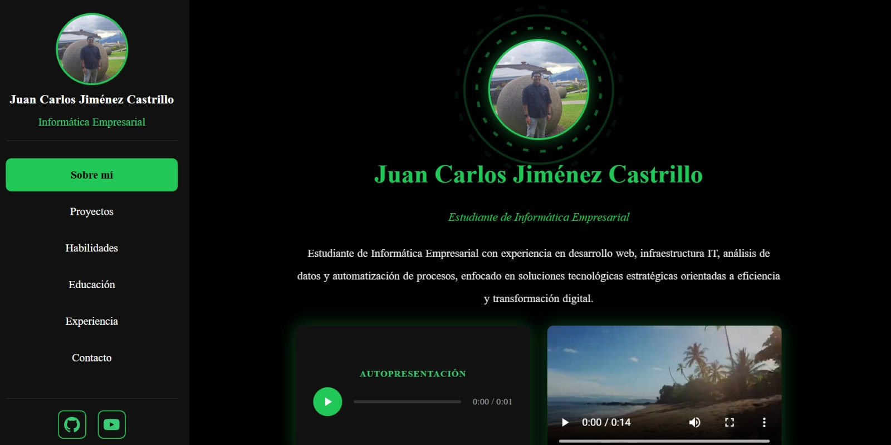
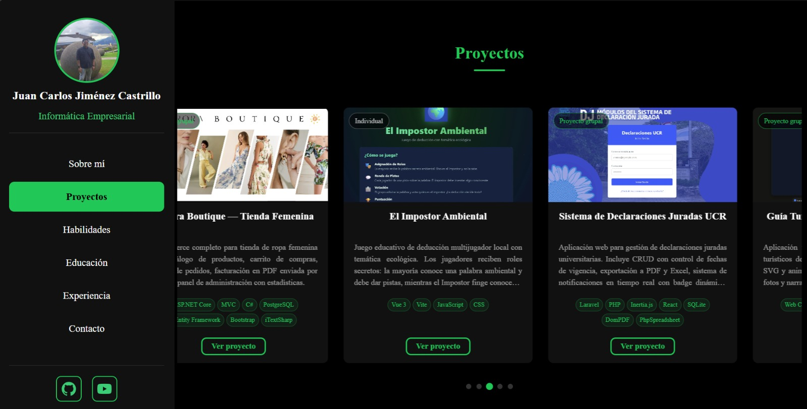
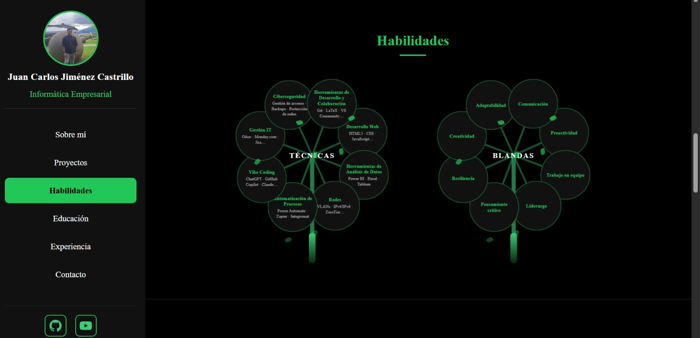
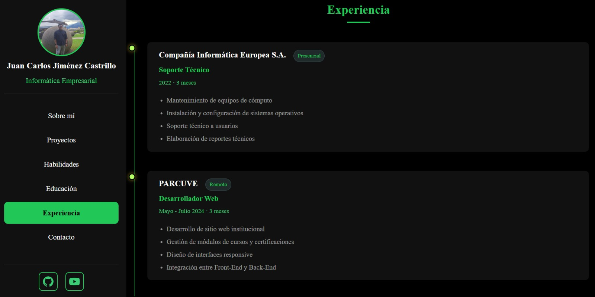
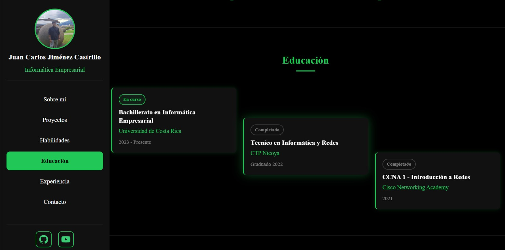
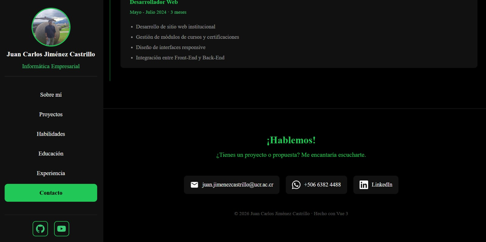

# Juan Carlos Jiménez | Portafolio Personal

Portafolio personal multimedia desarrollado con **Vue 3** + **Vite** como proyecto para el curso IF7102 Multimedios — Universidad de Costa Rica, I Ciclo 2026.

## Framework elegido

**Vue 3** con Composition API y `<script setup>` (declarado desde la semana 12).

## Descripción

Sitio web de presentación profesional — Opción 1: Portfolio Multimedia Personal. Incluye secciones de presentación, habilidades, experiencia, educación e información de contacto. Los datos se cargan dinámicamente desde `public/data/portafolio.json` con `fetch()`.

## Tecnologías

- Vue 3 + Composition API
- Vite (bundler y servidor de desarrollo)
- CSS nativo con variables personalizadas (paleta "Hills")
- Google Fonts — Inter
- JSON + fetch() para carga de datos

## Requisitos

- Node.js 18+
- pnpm (recomendado) o npm

## Instalación y ejecución

```bash
pnpm install
pnpm run dev
```

O con npm:

```bash
npm install
npm run dev
```

## Estructura del proyecto

```
portafolio-personal/
├── public/
│   ├── data/
│   │   └── portafolio.json    # Datos personales y CV
│   └── favicon.ico
├── src/
│   ├── assets/                # Imágenes, audio, recursos propios
│   ├── components/            # Componentes Vue reutilizables
│   ├── css/
│   │   └── global.css         # Estilos globales + paleta Hills
│   ├── App.vue
│   └── main.js
├── index.html
└── package.json
```

## Capturas de pantalla

| Sección | Vista |
|---|---|
| Sobre mí |  |
| Proyectos |  |
| Habilidades |  |
| Experiencia |  |
| Educación |  |
| Contacto |  |

## Información del curso

- **Curso:** IF7102 - Multimedios | I Ciclo 2026
- **Carrera:** Informática Empresarial — Sedes Regionales, UCR
- **Opción:** 1 — Portfolio Multimedia Personal
- **Entrega:** Semana 15 (15–20 Jun 2026)
